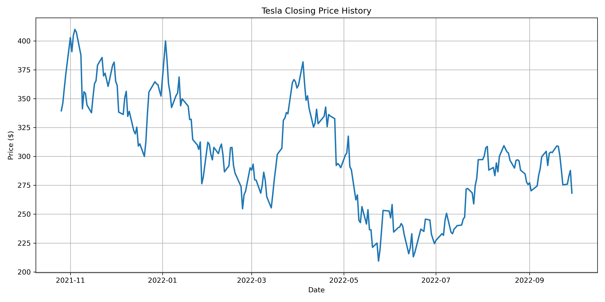
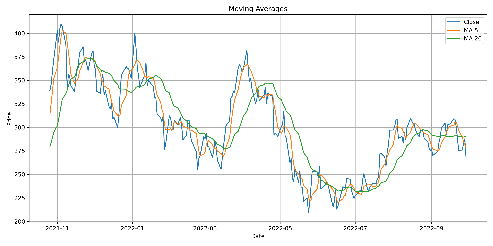
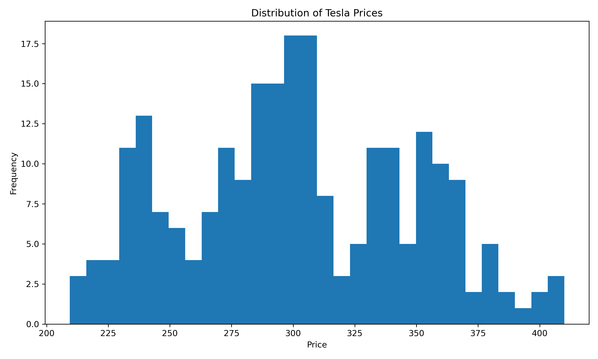
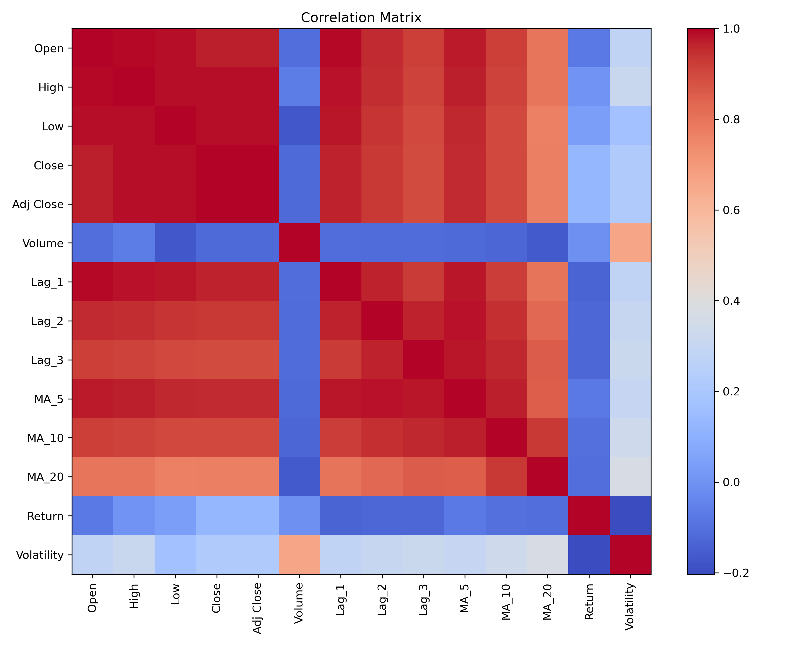
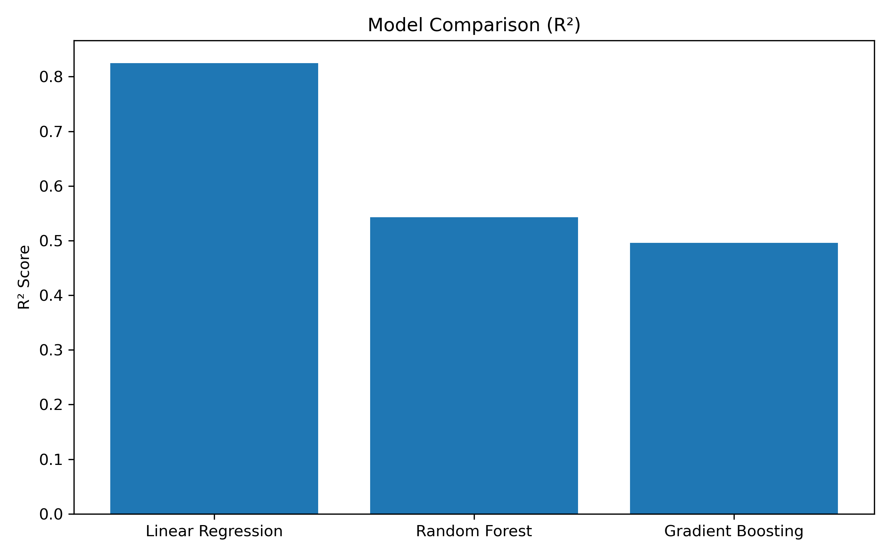
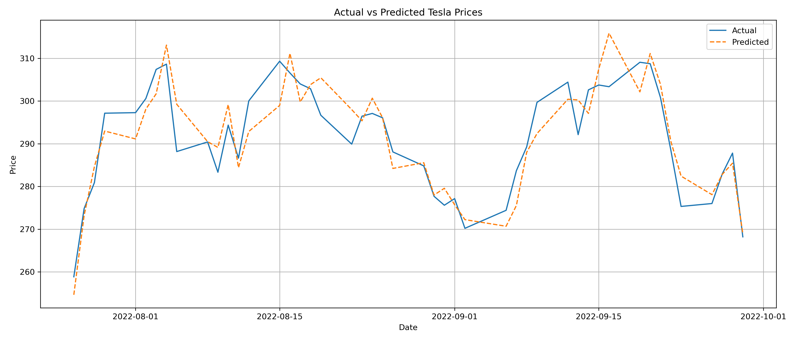
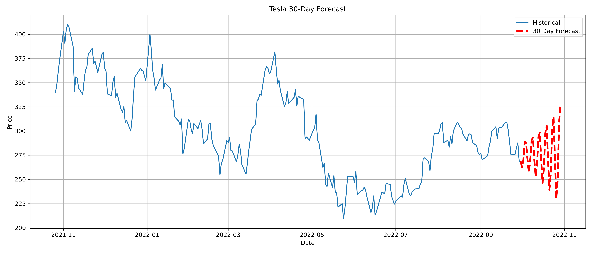

# Tesla Stock Forecasting Using Machine Learning

Predicting Tesla stock closing prices using machine learning, feature engineering, and time-series analysis.

---

## Project Overview

This project explores Tesla historical stock data and applies machine learning models to forecast future closing prices.

The goal is to build a complete forecasting pipeline that includes:

- Data Exploration
- Feature Engineering
- Time Series Analysis
- Model Comparison
- Performance Evaluation
- Future Price Forecasting

---

## Business Problem

Stock prices are influenced by historical market behavior, volatility, and trading activity.

This project investigates whether machine learning models can leverage historical Tesla stock data to forecast future closing prices and identify the most influential predictors.

---

## Dataset

Tesla Historical Stock Market Data

Features include:

- Open Price
- High Price
- Low Price
- Close Price
- Volume

---

## Technologies Used

- Python
- Pandas
- NumPy
- Matplotlib
- Scikit-Learn

---

## Feature Engineering

Several time-series features were created to improve predictive performance:

### Lag Features

- Lag_1
- Lag_2
- Lag_3

### Moving Averages

- MA_5
- MA_10
- MA_20

### Market Indicators

- Daily Return
- Volatility (High - Low)
- Trading Volume

---

## Exploratory Data Analysis

### Tesla Closing Price History



---

### Moving Average Analysis



---

### Price Distribution



---

### Correlation Matrix



---

## Machine Learning Models

Three machine learning models were evaluated:

### Linear Regression

A baseline regression model used for comparison.

### Random Forest Regressor

An ensemble learning model using multiple decision trees.

### Gradient Boosting Regressor

A boosting algorithm that improves prediction accuracy through sequential learning.

---

## Model Performance Comparison



Models were evaluated using:

- Mean Absolute Error (MAE)
- Root Mean Squared Error (RMSE)
- R² Score

---

## Actual vs Predicted Prices



This visualization compares actual Tesla closing prices with model predictions on the test dataset.

---

## Feature Importance


Feature importance analysis helps identify which variables contribute most to prediction accuracy.

Key observations:

- Lag features were among the strongest predictors.
- Moving averages improved model performance.
- Volume contributed less than historical price patterns.

---

## 30-Day Tesla Forecast



Using the best-performing model, a 30-day future forecast was generated to estimate potential stock price movement.

---

## Project Outputs

Generated files include:

```text
future_predictions.csv
model_comparison.csv
```

Generated visualizations:

```text
01_price_history.png
02_moving_averages.png
03_distribution.png
04_correlation_matrix.png
05_model_comparison.png
06_actual_vs_predicted.png
07_feature_importance.png
08_future_forecast.png
```

---

## Project Structure

```text
Tesla-Stock-Forecasting
│
├── data/
│   └── TESLA.csv
│
├── images/
│   ├── 01_price_history.png
│   ├── 02_moving_averages.png
│   ├── 03_distribution.png
│   ├── 04_correlation_matrix.png
│   ├── 05_model_comparison.png
│   ├── 06_actual_vs_predicted.png
│   ├── 07_feature_importance.png
│   └── 08_future_forecast.png
│
├── outputs/
│   ├── future_predictions.csv
│   └── model_comparison.csv
│
├── Tesla_Stock_Forecasting.ipynb
├── tesla_stock_forecasting.py
├── requirements.txt
└── README.md
```

---

## Future Improvements

Potential enhancements include:

- XGBoost Regressor
- LSTM Neural Networks
- Facebook Prophet
- Hyperparameter Optimization
- Real-Time Stock Data Integration

---

## Author

**Mostafa Abouzeed**

Master of Science in Data Science  
Boston University

LinkedIn:
(https://www.linkedin.com/in/mostafa-abouzeed/)

GitHub:
(https://github.com/mostafaabouzeed)
